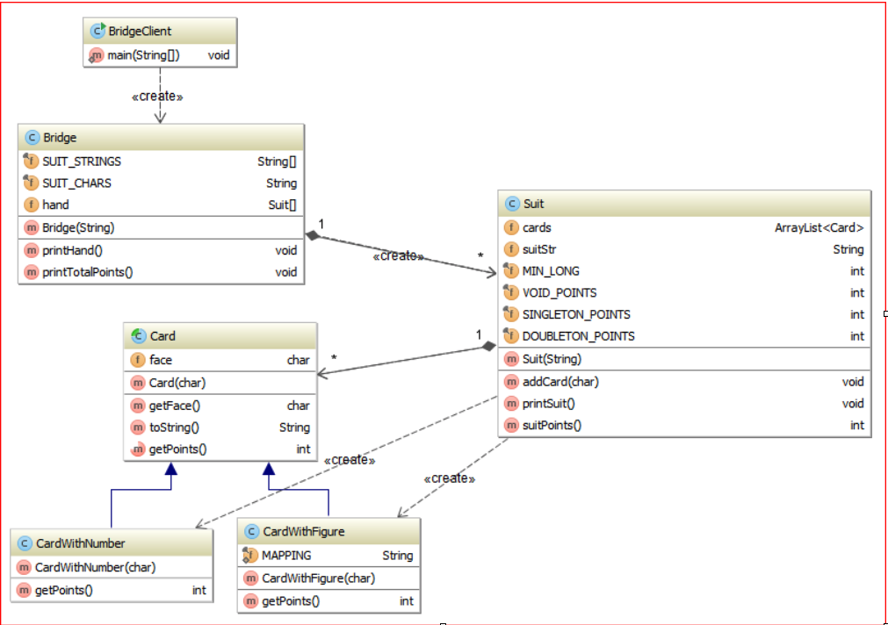

# BridgeGame-Lab

### Problem Description:

Bridge is a very challenging card game in which two teams of two players each compete for tricks. The actual game is preceded by bidding, so it is important to know the value of a player's hand, the estimated strength of the thirteen cards that a player gets during the deal. 
Write a program that sorts and evaluates bridge hands. The input is a stream of character pairs that represent playing cards. Each pair consists of a rank followed by a suit, where:

* rank is 2, 3, … , 9, T (ten), J (jack), Q (queen), K (king), or A (ace). HINT: Internally you can represent rank as 2, 3, …  9, 10, 11 (jack), 12 (queen), 13 (king), and 14 (ace).
* suit is C (club), D (diamond), H (heart), or S (spade).

You can assume that each input line represents exactly 13 cards and is error-free. For example,

2C QD TC AD 6C 3D TD 3H 5H 7H AS JH KH

represent a hand of  2 of clubs, queen of diamonds, 10 of clubs, ace of diamonds, and so on.

The input is provided in the file called hands.txt, where each line consists of one hand of 13 cards obtained from the card dealer. 
Your program should form a hand of 13 cards and display it arranged by suits followed by the hand strength calculated by using the following standard bridge values:

* Aces count 4
* Kings count 3  
* Queens count 2
* Jacks count 1
* Voids (no cards in a suit) count 3
* Singletons (one card in a suit) count 2
* Doubletons (two cards in a suit) count 1
* Long suits with more than 5 cards in a suit count 1 for each card over the count of 5.  
For example in the sample run below there are 7 cards in the suit of Hearts, so there will be 2 points added for the “long suit”

**Sample Run:**

Analyzing hand: 2C QC TC AC 6C 3C TH 3H 5H 7H AH JH KH  
Clubs:    2 Q T A 6 3  
Hearts:   T 3 5 7 A J K  
Total Points: 23  

Analyzing hand: 2C QD TC AD 6C 3D TD 3H 5H 7H AS JH KH  
Clubs:    2 T 6  
Diamonds: Q A 3 T  
Hearts:   3 5 7 J K  
Spades:   A  
Total Points: 16  

Analyzing hand: 2C QD TC AD 6H 3D TD 3H 5H 7H AS JH KH  
Clubs:    2 T  
Diamonds: Q A 3 T  
Hearts:   6 3 5 7 J K  
Spades:   A  
Total Points: 18  

Analyzing hand: 2C QD TC AD 6S 3D TD 3H 5C 7H AS JH KS  
Clubs:    2 T 5  
Diamonds: Q A 3 T  
Hearts:   3 7 J  
Spades:   6 A K  
Total Points: 14  

**NOTE:  The singleton (ace of spades in the second example) counts as both an ace and a singleton.**

__**UML DIAGRAM**__  

#### Class Descriptions  

*BridgeClient* has the main method that:  
* creates Scanner object that will allow reading from the hands.txt file  
for each line in the file  
*creates a Bridge object (by calling the appropriate constructor)  
*calls printHand method  
*calls printTotalPoints method  

*Card* is an abstract class that represents a single card in the given hand. It contains: 
* one instant variable:  
face of the card : 2,3, …, 9,T,J,Q,K,A
* *toString* and accessor method  
* abstract method *getPoints* that when implemented by the subclass calculates the value of the card  

*CardWithFigure* extends the Card and contains implementation of getPoints method for card objects with faces: T, J, Q, K, or A.   
It defines final String MAPPING that is set to “TJQKA”. It uses this string to calculate points.  
Notice that the number of points corresponds to the position of the appropriate letter in the MAPPING string:  

    Aces   count as 4  = 14 - 10  
    Kings  count as 3  = 13 - 10  
    Queens count as 2  = 12 – 10  
    Jacks  count as 1  = 11 – 10  
    Tens   count as 0  = 10 - 10  
    
    
*CardWithNumber* extends the *Card* and contains implementation of *getPoints* method for card objects with faces: 2,3,…, or 9  

Suit class implements set of cards in a suit. It contains:   
two instant variables:
* cards – ArrayList of Card objects in one suit that the hand contains  
* suitStr – the name of the suit this object represents: Clubs, Diamonds, Hearts or Spades  
constructor that instantiates cards with the default ArrayList constructor, and sets the suitStr to the given value
* addCard method – creates an appropriate Card object and adds it to the cards list
* printSuit method – displays all the cards in the suit
* suitPoints method – calculates the card points in the suit

*Bridge* class contains:  
several instance variables:  
* hand – array of Suit objects for the given hand
* SUIT_STRINGS – array of names of suits
* SUIT_CHARS – a String containing first letters of each suit: 
“CDHS” that can be used for mapping of the input suit value to the name of the suit. 
For example if the input  is 2D – the index of ‘D’ in the SUIT_CHARS gives us index of “Diamonds” in the SUIT_STRINGS array
several methods:  
* *Bridge* (the constructor) 
instantiates the instance variable hand
takes the input line and fills the hand with appropriate data
* *printHand method* -  prints all four suits (please see the sample run, it is possible that some suits are not present) 
* *printTotalPoints* method - calculates total points for the given hand 
    

